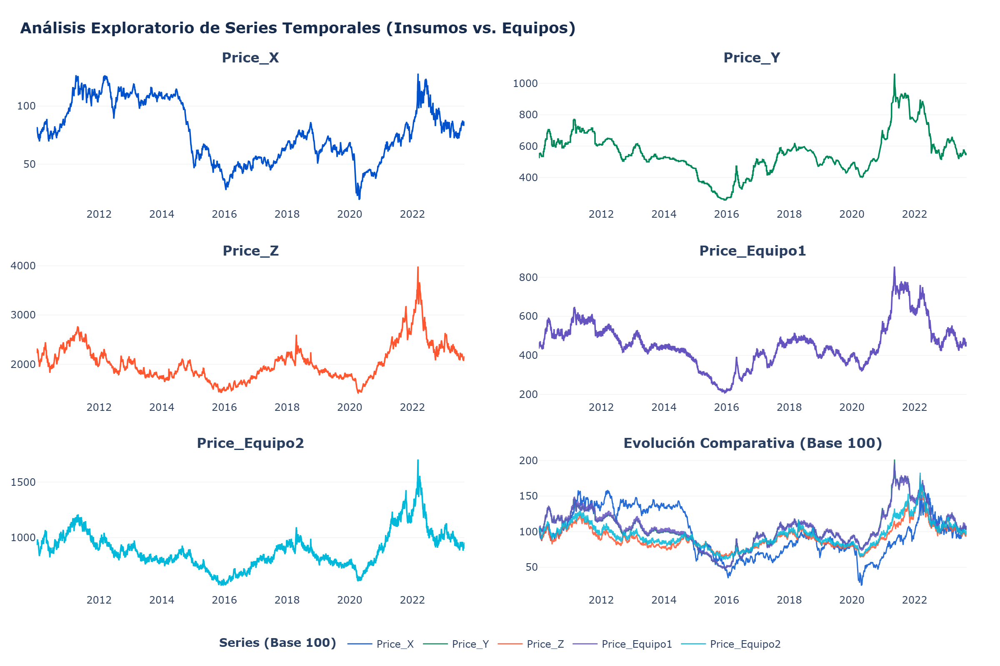

# README: Sistema Predictivo de Costos de Equipos de Construcción

## Introducción

Este ejercicio es una buena oportunidad para comprender la dinámica relacionada con la previsión presupuestaria en los proyectos del sector construcción. Al investigar mas a fondo en la literatura me he dado cuenta que la complejidad de los proyectos va mas allá de la magnitud de la obra civil y que también existen retos presupuestarios, operativos, de planificación e incluso de mercado de insumos que deben tomarse en cuenta para llevar a cabo cualquier obra de construcción. En lo que respecta a la planificación, poder contar con metodologias que reduzcan la incertidumbre ayuda significativamente a que el negocio sea rentable y sostenible en el tiempo. 

## Entendimiento del problema

Sobre la base de la presentación del caso de negocio hay varias precisiones que se derivan de su lectura. Uno de los problemas centrales del caso es la imposiblidad de la empresa de anticipar los costos de adquisición de dos tipos de equipos que se usan en campo. Por otro lado, la gerencia tiene una sospecha (por cierto, bastante intuitiva) de que el precio de estos equipos estan atados o dependen directamente de la dinámica del mercado de materias primas, es decir, los insumos que se requieren para construir tales equipos. 

Por otro lado, el caso nos da información importante. Al hablar de **costos de adquisición**, en el fondo lo que está afirmando a que categoria de gestión de proyectos corresponden estos equipos. Claramente, se trata de gastos de capital (CAPEX). También, el texto informa que la empresa se encuentra en la fase de planificación de un proyecto, es decir, apenas está evaluando la viabilidad de la idea, haciendo pruebas de concepto, planificando el capital a largo plazo y determinando los planes de negocio. Es justo aquí donde la metodologia analítica para la previsión presupuestaria cobra una importancia clave.

## Objetivos

### General

El objetivo de este proyecto es desarrollar una metodología analítica que permita predecir el costo futuro de adquisición de equipos asociados directamente a la dinámica del mercado de materias primas. 

## Específicos

    * Realizar un analisis descriptivo de los datos suministrados para conocer el comportamiento de las series de datos.
    * Construir un modelo predictivo base para generar predicciones a corto y mediano plazo del precio de los equipos.
    * Construir una aplicación sencilla integrada con un agente de IA que pueda dar respuesta a inquietudes del área de negocios.
    * Desplegar la aplicación en un servicio de nube.

## Terminología básica

Para asegurar una correcta interpretación del modelo dentro del entorno de la ingeniería de costos, se definen los siguientes términos:

*   **CAPEX (Gastos de Capital):** Se refiere a inversiones en activos tangibles o intangibles que aportan valor económico a la empresa durante más de un año. Estos gastos incluyen la compra de maquinaria, vehículos, equipos informáticos, licencias de software perpetuas, reformas significativas en oficinas o desarrollo interno de productos tecnológicos capitalizables.
*   **OPEX (Gastos Operativos):** Gastos recurrentes del día a día para operar la empresa (ej. luz, salarios, alquiler). Se deducen completamente en el año fiscal actual.
*   **AACE (AACE International):** La Autoridad Internacional para la Gestión del Costo Total (Total Cost Management). Es el organismo que proporciona las directrices y estándares (Recommended Practices) globales para la ingeniería de costos y presupuestación.
*   **Clases del AACE:** Es el sistema de clasificación de estimaciones de costos que asocia el nivel de madurez o definición de un proyecto con una metodología de cálculo y un rango de precisión esperado. Las etapas tempranas de planeación corresponden a la **Clase 5** (0% a 2% de definición) y **Clase 4** (1% a 15% de definición), requiriendo métodos paramétricos y estocásticos.
*   **INPP (Índice Nacional de Precios Productor):** Es un indicador estadístico macroeconómico que mide las variaciones a través del tiempo de los precios de los bienes y servicios que se producen en el país para consumo interno y exportación. En este modelo, funciona como variable de control para identificar la inflación.

## Investigación del escenario en Construcción

En las fases tempranas de los proyectos (Clase 5 y 4), la prevision de los materiales, equipos, alquileres, consumibles, etc son de vital importancia ya que en función de la optimización de estos recursos podrian obtenerse mejores márgenes de ganancia. En un proyecto, cuando se trata de equipamiento, como maquinarias y equipos especializados la clasificación de tales gastos pueden darse en dos escenarios: Si el proyecto es de corto plazo (6 a 12 meses), normalmente los equipos se arriendan y se consideran como OPEX, pues al final del periodo estos equipos y maquinarias no pasarán a formar parte de los activos de la empresa. Sin embargo, si el contrato de alquiler es mayor de 12 meses o incluye una opción de compra al final, las normas contables internacionales como la IFRS 16 obligan a registrarlo en el balance general como un "activo por derecho de uso". En ese caso específico, el tratamiento contable se asemeja al CAPEX porque el activo se deprecia con el tiempo.

De acuerdo con Solís-Carcaño 2019, los equipos de construcción no tienen un costo de producción estático, sino que están definidos por una estructura de manufactura en la cual los metales y aleaciones base (acero, aluminio, cobre) tienen un gran peso en el valor final [https://www.redalyc.org/journal/467/46761359008/html/]. Por otro lado, de acuerdo con Jiménez-Rodríguez 2022, los precios de los equipos se ven afectados por un mecanismo de transmisión retardado y parcial conocido como el efecto *pass-through* (transferencia de precios). Si los metales suben de precio drásticamente en el mercado global, se generan riesgos críticos de incumplimiento en la cadena de suministro, ya que los fabricantes podrían rescindir los contratos a precio fijo para mejorar sus márgenes de ganancia [https://link.springer.com/article/10.1007/s10290-021-00425-2]. Por lo tanto, en la gestión de proyectos de construcción es una necesidad imperativa estimar y prever de manera sistemática los costos a futuro, permitiendo a los contratistas y dueños planificar el capital a largo plazo y blindar los contratos contra la inflación antes de comprometer los recursos. 

Todo lo anterior coincide con la hipótesis que plantea la gerencia del proyecto, es decir: la presunción de que el precio de los equipos está intimamente relacionado con el precio de las materias primas. Como afirma Jiménez-Rodríguez 2022, esto se debe a la transmisión de precios asociados con rezagos o retardos en el tiempo. Esta observación puede desde ya indicarnos, grosso modo, un metodologia para solucionar el problema: determinar si existe una relación de dependencia de las series históricas rezagadas del precio de materias primas con la serie histórica del precio de los equipos.

## Sobre los datos

Al realizar una inspección rápida a las fuentes de datos suministradas se observan 5 series históricas de frecuencia diaria (bussiness days: lunes a viernes): **Price_X**, **Price_Y**, **Price_Z**, **Price_Equipo1** y **Price_Equipo2**. La fecha de inicio y finalización corresponden a los dias 2010-01-04 y 2023-08-31 respectivamente.

## Condiciones iniciales o supuestos

El desarrollo del modelo parte de las siguientes premisas y adecuaciones sobre los datos disponibles:

*   **Frecuencia de datos:** La base de datos original contiene variables históricas a nivel diario (días laborables o *business days*). Para alinear estos datos con los índices macroeconómicos (INPP) y con los mecanismos contractuales de pago, los datos diarios se transforman a frecuencia mensual.
*   **Agrupamiento temporal:** Se utiliza un agrupamiento mensual con etiqueta de cierre de mes (`M`) para recrear las condiciones reales en las que se publican los índices oficiales.
*   **Procesamiento de la media:** La mensualización se hace bajo el criterio de promedio del precio ponderado por el tiempo de vigencia. Esto ayuda a la convergencia de las fluctuaciones interdiarias que se observan en los proyectos de construcción.
*   **Variables macroeconómicas:** En este ejercicio podrian incorporarse variables adicionales como el indice de precios al productor IPP. Al conocer la referenciación geográfica del proyecto, podria sumarse como variable de ajuste a la predicción del precio del equipo.  

## Metodología analítica

La estrategia analítica del modelo se compone de dos etapas principales: analisis exploratorio de las series (transformación y filtrado de ruido económico) y análisis y modelado de las series de tiempo.

1.  **Filtrado con Análisis Wavelet (WTC y PWC):** Para descubrir las relaciones de adelanto y retraso (lead-lag) entre los insumos (X, Y, Z) y el costo del equipo, se utiliza el análisis de tiempo-frecuencia. Se aplica fundamentalmente la Coherencia Wavelet Parcial (PWC) introduciendo el **INPP** como variable macroeconómica. Esto permite aislar y descontar matemáticamente el efecto de la inflación general del mercado, asegurando que las materias primas elegidas como características (*features*) explican verdaderamente la variabilidad del costo del equipo, y no son solo ruido económico.
2. **Analisis de Causalidad de Granger:** Este método evalua si una serie de tiempo ayuda a predecir otra. Sin embargo, es preciso aclarar que no se trata de una causalidad real, pero sirve como marco de referencia. Esta prueba se sigue a un modelo de vectores autorregresivos VAR, los cuales no son mas que un sistema de ecuaciones multivariantes que permiten analizar la dinámica conjunta de varias series temporales, explicando cada variable por sus propios rezagos y los de las demás variables del sistema.
3.  **Modelado Predictivo con Machine Learning:** Una vez depuradas y/o elegidas las variables explicativas y eliminando el ruido, la base de datos se divide en conjuntos de entrenamiento, validación y prueba (*train/validation/test*). Se implementa una red neuronal profunda de memoria a corto y largo plazo (**LSTM**), la cual ha demostrado empíricamente superar a los modelos tradicionales (como ARIMA) hasta en un 59% de exactitud al predecir series temporales de la industria de la construcción (Boge Lyu & Qianye Yin & Iris Denise Tommelein & Hanyang Liu & Karnamohit Ranka & Karthik Yeluripati & Junzhe Shi, 2025) [https://ideas.repec.org/p/arx/papers/2512.09360.html]. Evidentemente, al tratarse de datos cronológicos, la separación de los conjuntos (train/validation/test) debe hacerse manteniendo el orden del tiempo.

## Predicción
Con el modelo LSTM entrenado, se proyectará el comportamiento del CAPEX del equipo bajo los siguientes marcos de acción:
*   **Horizonte de corto plazo (1 a 2 meses):** Actuará como un panel de alertas tempranas para que el área de abastecimiento se anticipe a las fluctuaciones agresivas en los mercados spot y evite sobrecostos repentinos.
*   **Horizonte de largo plazo (8 a 16 meses):** Dictará los valores de planeación para establecer el presupuesto de inversión financiera.
*   **Ajuste por Escalamiento (Opcional):** Si el proyecto requiere un equipo con una capacidad física ($S_B$) distinta a la capacidad base del equipo predicho ($S_A$), se aplicará al resultado del modelo el factor de escala de la Ecuación General de Escalamiento ($C_B = C_A \cdot (S_B/S_A)^N$).

## Intervalos de confianza
Al estar en fases tempranas de planeación, el modelo incorpora la incertidumbre inherente al nivel de madurez del proyecto, integrando simulaciones estocásticas basadas en los rangos recomendados por la AACE.

A las predicciones puntuales de la red LSTM se les acoplará una **Simulación de Montecarlo** para generar distribuciones probabilísticas que proyecten la variabilidad del costo de adquisición. Se establecerán tres intervalos clave orientados a la toma de decisiones con un nivel de confianza del 80%:
1.  **Escenario Optimista (Límite Inferior):** Representa una posible deflación en el costo de los insumos o una alta economía de escala. Se asocia al rango bajo típico de una estimación Clase 5 (aprox. **-20% a -50%** del valor base).
2.  **Escenario Equilibrado (Valor Base):** Es la línea de tendencia central arrojada directamente por el motor de Machine Learning, asumiendo un riesgo moderado.
3.  **Escenario Pesimista (Límite Superior):** Contempla disrupciones severas en la cadena de suministro o picos inflacionarios. Alineado al estándar de la AACE, este techo establece una reserva financiera que oscila entre un **+30% y un +100%** de incremento sobre el valor base predicho.

## Análisis Exploratorio de Datos (EDA)

A continuación se muestra la evolución comparativa de las materias primas frente a los equipos en Base 100:

