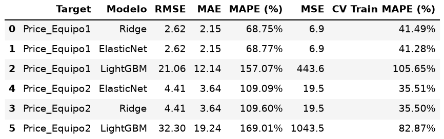
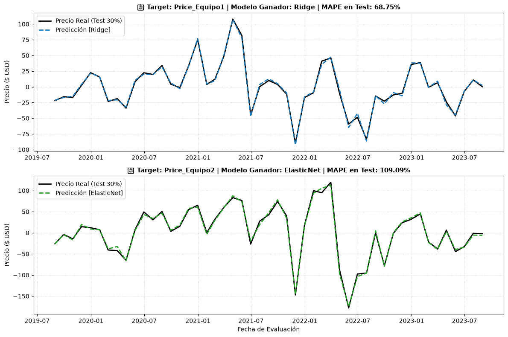
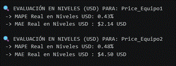
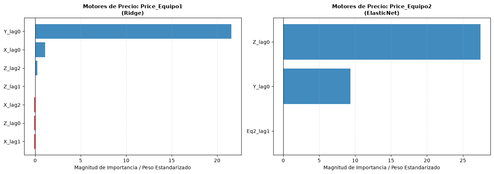
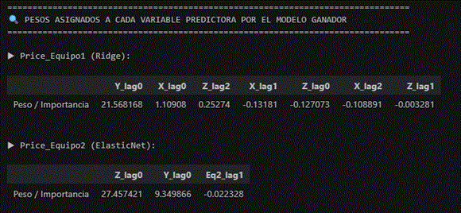
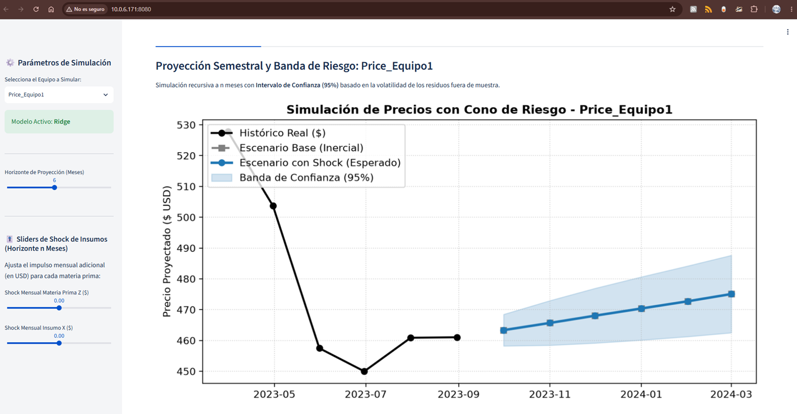
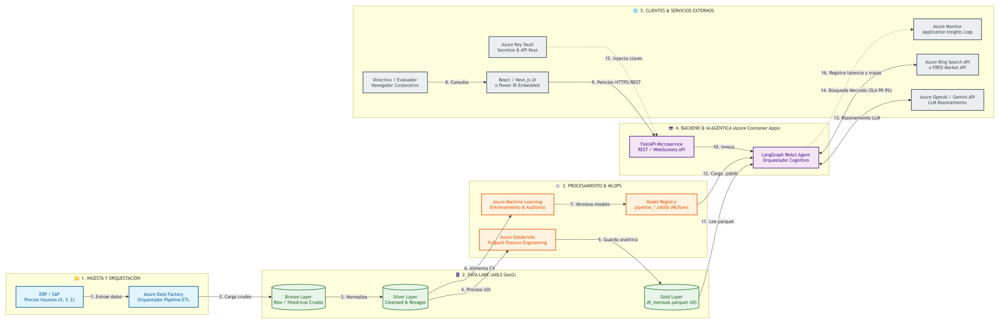

# README: Sistema Predictivo de Costos de Equipos de Construcción

## Introducción

Este ejercicio es una buena oportunidad para comprender la dinámica relacionada con la previsión presupuestaria en los proyectos del sector construcción. Al investigar mas a fondo en la literatura me he dado cuenta que la complejidad de los proyectos va mas allá de la magnitud de la obra civil y que también existen retos presupuestarios, operativos, de planificación e incluso de mercado de insumos que deben tomarse en cuenta para llevar a cabo cualquier obra de construcción. En lo que respecta a la planificación, poder contar con metodologias que reduzcan la incertidumbre ayuda significativamente a que el negocio sea rentable y sostenible en el tiempo. En este documento y en el código desarrollado hablaré indistantemente en primera o tercera persona. 

## Entendimiento del problema

Sobre la base de la presentación del caso de negocio hay varias precisiones que se derivan de su lectura. Uno de los problemas centrales del caso es la imposiblidad de la empresa de anticipar los costos de adquisición de dos tipos de equipos que se usan en campo. Se entiende que ambos equipos son necesarios de forma permanente en el proyecto para la ventana de ejecución definida.  Por otro lado, la gerencia tiene una sospecha (por cierto, bastante intuitiva) de que el precio de estos equipos estan atados o dependen directamente de la dinámica del mercado de materias primas, es decir, los insumos que se requieren para construir tales equipos. 

El planteamiento del caso nos da información importante. Al hablar de **costos de adquisición**, se puede presumir que los equipos pertenecen a la categoria de  gastos de capital (CAPEX). También, el texto informa que la empresa se encuentra en la fase de planificación de un proyecto, es decir, apenas está evaluando la viabilidad de la idea, haciendo pruebas de concepto, planificando el capital a largo plazo y determinando los planes de negocio. Es justo aquí donde la metodologia analítica para la previsión presupuestaria cobra una importancia clave.

## Objetivos

### General

El objetivo de este proyecto es desarrollar una metodología analítica que permita predecir el costo futuro de adquisición de equipos asociados directamente a la dinámica del mercado de materias primas. 

## Específicos

* Realizar un analisis descriptivo de los datos suministrados para conocer el comportamiento de las series de datos.
* Construir un modelo predictivo base para generar predicciones a corto y mediano plazo del precio de los equipos.
* Construir una aplicación sencilla integrada con un agente de IA que pueda dar respuesta a inquietudes del área de negocios.
* Plantear una arquitectura para el despliegue del modelo predictivo en la nube.

## Terminología básica

Para asegurar una correcta interpretación del modelo dentro del entorno de la ingeniería de costos, se definen los siguientes términos:

*   **CAPEX (Gastos de Capital):** Se refiere a inversiones en activos tangibles o intangibles que aportan valor económico a la empresa durante más de un año. Estos gastos incluyen la compra de maquinaria, vehículos, equipos informáticos, licencias de software perpetuas, reformas significativas en oficinas o desarrollo interno de productos tecnológicos capitalizables.
*   **OPEX (Gastos Operativos):** Gastos recurrentes del día a día para operar la empresa (ej. luz, salarios, alquiler). Se deducen completamente en el año fiscal actual.
*   **AACE (AACE International):** La Autoridad Internacional para la Gestión del Costo Total (Total Cost Management). Es el organismo que proporciona las directrices y estándares (Recommended Practices) globales para la ingeniería de costos y presupuestación.
*   **Clases del AACE:** Es el sistema de clasificación de estimaciones de costos que asocia el nivel de madurez o definición de un proyecto con una metodología de cálculo y un rango de precisión esperado. Las etapas tempranas de planeación corresponden a la **Clase 5** (0% a 2% de definición) y **Clase 4** (1% a 15% de definición), requiriendo métodos paramétricos y estocásticos.
*   **INPP (Índice Nacional de Precios Productor):** Es un indicador estadístico macroeconómico que mide las variaciones a través del tiempo de los precios de los bienes y servicios que se producen en el país para consumo interno y exportación. En este modelo, funciona como variable de control para identificar la inflación.  

## Investigación del escenario en al área de la construcción

En las fases tempranas de los proyectos (Clase 5 y 4), la previsión de los materiales, equipos, alquileres, consumibles, etc son de vital importancia ya que en función de la optimización de estos recursos podrían obtenerse mejores márgenes de ganancia. En un proyecto, cuando se trata de equipamiento como maquinarias y equipos especializados, la clasificación de tales gastos pueden darse en dos escenarios: Si el proyecto es de corto plazo (6 a 12 meses), normalmente los equipos se arriendan y se consideran como OPEX, pues al final del periodo estos equipos y maquinarias no pasarán a formar parte de los activos de la empresa. Sin embargo, si el contrato de alquiler es mayor de 12 meses o incluye una opción de compra al final, las normas contables internacionales como la IFRS 16 obligan a registrarlo en el balance general como un "activo por derecho de uso". En ese caso específico, el tratamiento contable se asemeja al CAPEX porque el activo se deprecia con el tiempo.

De acuerdo con Solís-Carcaño (2019), los equipos de construcción no tienen un costo de producción estático, sino que están definidos por una estructura de manufactura en la cual los metales y aleaciones base (acero, aluminio, cobre) tienen un gran peso en el valor final [https://www.redalyc.org/journal/467/46761359008/html/]. Por otro lado, de acuerdo con Jiménez-Rodríguez (2022), los precios de los equipos se ven afectados por un mecanismo de transmisión retardado y parcial conocido como el efecto *pass-through* (transferencia de precios). Si los metales suben de precio drásticamente en el mercado global, se generan riesgos críticos de incumplimiento en la cadena de suministro, ya que los fabricantes podrían rescindir los contratos a precio fijo para mejorar sus márgenes de ganancia [https://link.springer.com/article/10.1007/s10290-021-00425-2]. Por lo tanto, en la gestión de proyectos de construcción es una necesidad imperativa estimar y prever de manera sistemática los costos a futuro, permitiendo a los contratistas y dueños planificar el capital a largo plazo y blindar los contratos contra la inflación antes de comprometer los recursos. 

Todo lo anterior coincide con la hipótesis que plantea la gerencia del proyecto, es decir: la presunción de que el precio de los equipos está intimamente relacionado con el precio de las materias primas. Como afirma Jiménez-Rodríguez (2022), esto se debe a la transmisión de precios asociados con rezagos o retardos en el tiempo. Esta observación puede desde ya indicarnos, grosso modo, un metodologia para solucionar el problema: determinar si existe una relación de dependencia de las series históricas rezagadas del precio de materias primas con la serie histórica del precio de los equipos.

## Sobre los datos

Al realizar una inspección rápida a las fuentes de datos suministradas se observan 5 series históricas de frecuencia diaria (bussiness days: lunes a viernes): **Price_X**, **Price_Y**, **Price_Z**, **Price_Equipo1** y **Price_Equipo2**. La fecha de inicio y finalización corresponden a los dias 2010-01-04 y 2023-08-31 respectivamente.

## Condiciones iniciales o supuestos

El desarrollo del modelo parte de las siguientes premisas y adecuaciones sobre los datos disponibles:

*   **Frecuencia de datos:** La base de datos original contiene variables históricas a nivel diario (días laborables o *business days*). Para alinear estos datos con los índices macroeconómicos (INPP) y con los mecanismos contractuales de pago, los datos diarios se transforman a frecuencia mensual.
*   **Agrupamiento temporal:** Se utiliza un agrupamiento mensual con etiqueta de cierre de mes (`M`) para recrear las condiciones reales en las que se publican los índices oficiales.
*   **Procesamiento de la media:** La mensualización se hace bajo el criterio de promedio del precio ponderado por el tiempo de vigencia. Esto ayuda a la convergencia de las fluctuaciones interdiarias que se observan en los proyectos de construcción.
*   **Variables macroeconómicas:** En este ejercicio podrían o no incorporarse variables adicionales como el indice de precios al productor IPP. Sin embargo, al no tener referencia sobre la geolocalización del proyecto, incluir una serie nacional podria no alinearse con el contexto del origen de los datos. Pero se considera muy importante incluir esta variable en una iteracipon posterior.


## Metodología analítica

La estrategia analítica del modelo se compone de tres etapas principales: análisis exploratorio de las series (transformación y filtrado de ruido económico), determinación de relaciones entre la variable objetivo y las "predictoras" y la creación de un modelo estadístico de predicción.

1.  **Analisis exploratorio de las series:** En este paso lo que se hace es conocer la estructura de la serie, realizar una visualización, determinar completitud, realizar imputaciones, remuestreos, etc.
2. **Analisis de Causalidad de Granger:** Este método evalua si una serie de tiempo ayuda a predecir otra. Sin embargo, es preciso aclarar que no se trata de una causalidad real, pero sirve como marco de referencia. Esta prueba se sigue a un modelo de vectores autorregresivos VAR, los cuales no son mas que un sistema de ecuaciones multivariantes que permiten analizar la dinámica conjunta de varias series temporales, explicando cada variable por sus propios rezagos y los de las demás variables del sistema.
3.  **Modelado Predictivo con Machine Learning:** Una vez depuradas y/o elegidas las variables explicativas y eliminando el ruido, la base de datos se divide en conjuntos de entrenamiento, validación y prueba (*train/validation/test*) y se realiza un benchamarking de modelos de predicción de series de tiempo. Vale la pena aclarar dos cosas. La tentación inicial es usar modelos clásicos con ARIMA, ARIMAX, GARCH, etc, pero estos modelos quedan descartados de entrada debido a la existencia de modelos con un mayor poder predictivo y que además toman en consideración relaciones de dependencia con otras series y no únicamente su estructura propia de tendencia, variabilidad y autorregresión. Tampoco se ha querido usar modelos de deep learning como el **LSTM**, el cual ha demostrado empíricamente superar a los modelos tradicionales (como ARIMA) hasta en un 59% de exactitud al predecir series temporales de la industria de la construcción (Boge Lyu & Qianye Yin & Iris Denise Tommelein & Hanyang Liu & Karnamohit Ranka & Karthik Yeluripati & Junzhe Shi, 2025) [https://ideas.repec.org/p/arx/papers/2512.09360.html]. La justificación es que para estos últimos modelos se requiere de un gran número de datos.
En este sentido, los modelos que competirán son ElasticNet, LightGBM y Ridge.

## Predicción
Con el mejor modelo, se proyectará el comportamiento del CAPEX del equipo bajo los siguientes marcos de acción:
*   **Horizonte de corto plazo (1 a 2 meses):** Actuará como un panel de alertas tempranas para que el área de abastecimiento se anticipe a las fluctuaciones agresivas en los mercados spot y evite sobrecostos repentinos.
*   **Horizonte de mediano plazo (3 a 7 meses):** Actuará como un panel de previsión usual o ventana de ejecución mínima.
*   **Horizonte de largo plazo (8 a 16 meses):** Dictará los valores de planeación para establecer el presupuesto de inversión financiera.


## Intervalos de confianza

Al estar en fases tempranas de planeación, el modelo incorpora la incertidumbre inherente al nivel de madurez del proyecto, integrando simulaciones estocásticas basadas en los rangos recomendados por la AACE.

A las predicciones puntuales de la red LSTM se les acoplará una **Simulación de Montecarlo** para generar distribuciones probabilísticas que proyecten la variabilidad del costo de adquisición. Se establecerán tres intervalos clave orientados a la toma de decisiones con un nivel de confianza del 80%:
1.  **Escenario Optimista (Límite Inferior):** Representa una posible deflación en el costo de los insumos o una alta economía de escala. Se asocia al rango bajo típico de una estimación Clase 5 (aprox. **-20% a -50%** del valor base).
2.  **Escenario Equilibrado (Valor Base):** Es la línea de tendencia central arrojada directamente por el motor de Machine Learning, asumiendo un riesgo moderado.
3.  **Escenario Pesimista (Límite Superior):** Contempla disrupciones severas en la cadena de suministro o picos inflacionarios. Alineado al estándar de la AACE, este techo establece una reserva financiera que oscila entre un **+30% y un +100%** de incremento sobre el valor base predicho.

## Análisis Exploratorio de Datos (EDA)

A continuación se muestra la evolución comparativa de las materias primas frente a los equipos en Base 100:


Aunque el conjunto de datos original registra observaciones diarias (días hábiles), he decidido realizar una agregación a frecuencia mensual. En la industria de la construcción, los horizontes de planificación, compras de CapEx, cronogramas de proyecto y cláusulas de reajuste de precios contractuales operan sobre ciclos mensuales. Asimismo, los costos de maquinaria pesada presentan rigidez de precios a corto plazo, por lo que el dato diario refleja principalmente ruido transaccional o feriados del mercado. Modular la serie a escala mensual captura con realismo el ciclo contractual de la construcción y mejora sustancialmente la señal predictiva del modelo para el horizonte de toma de decisiones de la gerencia.


Al menos en la inspección visual, las series *Price_Z* y *Price_Equipo2* y *Price_Y* y *Price_Equipo1* parecen ser idénticas entre si (o al menos parecen estar relacionadas por un factor multiplicativo en la escala). Este efecto visual podria indicar que estan correlacionadas. Sin embargo, no seria correcto decir que una explica a la otra ya que en el fondo podria tratarse de correlación espuria. Un tratamiento correcto para determinar tal relación es realizando pruebas de estacionariedad, causalidad (como la de Granger) u observando las series diferenciadas. 

# Pruebas de estacionariedad y causalidad

En esta sección voy a realizar algunas pruebas iniciales que permitirán dilucidar las posibles relaciones entre las variables.
En series financieras y de precios (como es este ejercicio), lo normal es que tengan raíz unitaria $I(1)$. Esto simplemente significa si la serie es volatil o no, es decir, si su media y varianza y autocorrelación se mantienen constantes en el tiempo o no.
Primero probaré en niveles (empezar con la serie cruda) y, si no se rechaza $H_0$ (serie no estacionaria), aplicaré primera diferencia logarítmica (tasas de crecimiento / retornos), que suele estabilizar tanto la media como la varianza. El test usual en este caso es el Test de Dickey-Fuller.


Lo que esta tabla nos dice es que las series no son estacionarias de forma pura ya que  los p-values de prueba son significativamente mayores a 0.01. Se ha elegido este valor de alfa tomando en cuenta la baja potencia del test ADF en muestras finitas ($N \approx 150$) (Enders, 2014; Schwert, 1989). De acuerdo con los autores, el test presenta una alta tasa de falsos positivos al diferenciar entre un verdadero proceso con raíz unitaria y uno estacionario con alta persistencia. No podemos rechazar $H_0$; por lo tanto, no son estacionarias en niveles (tienen tendencia o inflación acumulada). Bajo el umbral formal del 1% ($\alpha = 0.01$), no se rechaza $H_0$ en niveles para ninguna de las cinco series, mientras que todas rechazan contundentemente $H_0$ en primera diferencia logarítmica ($p \le 0.0009$). Esto finalmente nos dice que las cinco variables se clasifican teórica y empíricamente como procesos integrados de orden uno ($I(1)$), es decir: podria tratarse de una caminata aleatoria.

## Obtención de rezagos óptimos

Para no adivinar el número de retardos (lags) en el test de Granger, ajustamos un modelo VAR preliminar con las series estacionarias y dejamos que los Criterios de Información (AIC, BIC, HQIC) nos sugieran la memoria temporal óptima del sistema. Tambien calculamos una matriz de Granger que nos permita conocer la causalidad en los pares de series predictora y objetivo. De acuerdo con la prueba de vectores autoregresivos en valor p = 2es el rezago adecuado para predecir el valor futuro de la serie. En la prueba (que no se muestra acá sino en el notebook de análisis exploratorio), el Criterio BIC penaliza la inclusión de variables adicionales de forma más severa en muestras pequeñas, sugiriendo un rezago óptimo de $p = 1$. Sin embargo, se priorizó el Criterio AIC ($p = 2$, coincidente con el criterio FPE), ya que en problemas de pronóstico predictivo es preferible preservar la dinámica temporal completa de los 60 días de traspaso de costos, evitando el sesgo por omisión de variables que generaría cortar la memoria en un solo mes.

La matriz de causalidad de Granger siguiente, muestra los resultados de las pruebas de hipótesis nula de Granger para cada par predictor-objetivo en diferentes rezagos:


- $H_0$: La serie del Insumo ($X, Y$ o $Z$) NO causa en el sentido de Granger al Precio del Equipo. \
- $H_1$: La historia del Insumo mejora estadísticamente la predicción del Equipo.

Se puede apreciar, por ejemplo que para el equipo 1, tanto las series X y Z son aparentes aportantes de causalidad de Granger hacia en el precio del Equipo 1 en los horizontes de varios meses (p-value < 0.05). Sin embargo, para el caso del equipo 2, el test concluye que ningún insumo causa en el sentido de Granger al Equipo 2. Lo que esto significa es que la mecánica de fijación de precios del Equipo 2 es instantánea y el test de Granger es completamente inutil para capturar esta estructura.  Cuando el insumo Z o el insumo Y suben de precio en un mes calendario, el fabricante del Equipo 2 ajusta su lista de precios en ese exacto mismo mes ($t = 0$). Esto es justamente lo que mencionaba Jiménez-Rodríguez (2022) respecto al efecto **pass-through**.

En el fondo esto nos dice que al parecer el Equipo 1 tiene que ver con fabricantes con contratos a precio fijo temporal o inventarios de amortiguación, ya que los precios de X y Z son predictivos y su ajuste de precio se va trasladando paulatinamente a lo largo de los meses.

Por el contrario, el equipo 2 tiene mas que ver con fabricantes que venden con cláusulas de indexación inmediata al precio del día o compras contra pedido directo. Basicamente, al cambiar el precio de los insumos, inmediatamente cambia el precio del equipo.

# Test de cointegración de Engle-Granger

El test de cointegración es una prueba que se realiza para encontrar una tendencia estocástica entre dos series no estacionarias que se mueven en la misma dirección. Este test es importante ya que vimos que nuestras series no son estacionarias y además que, al menos visualmente, parece existir una especie de relación entre pares de ellas (ejemplo Price_Z y Price_Equipo2).


Lo que nos dicen estas tablas es lo siguiente:

- Price_Z está cointegrado tanto con el Equipo 1 ($p = 0.0342$) como con el Equipo 2 ($p = 0.0268$). Esto podria indicar que el insumo Z dicta el precio de equilibrio a largo plazo de ambos equipos.
- El test de Granger decia que nada explicaba al Equipo 2. Y la razón es la siguiente: Tiene un equilibrio de largo plazo con Price_Z ($p = 0.0268$) y con Price_Y ($p = 0.0144$). Su correlación en retornos en el mismo mes (Lag 0) con Price_Z es de 0.9570 (95.5%) y en niveles de 0.9874. Si miramos la correlación en el lag 1(r), baja a 0.31 y luego en lag 2(r) a 0.0331 Esto demuestra que el fabricante del Equipo 2 ajusta sus precios de forma instantánea e indexada a los insumos Z e Y en el mismo mes.

# Conclusiones

- Se determinó que todas las series son procesos integrados de orden uno ($I(1)$ en niveles al umbral estricto de $\alpha = 0.01$) y estrictamente estacionarios en primera diferencia logarítmica ($I(0)$ con $p \le 0.0009$). Este hallazgo habilita el uso de retornos mensuales sin riesgo de regresiones espurias (se equilibran a largo plazo).
- El test de Engle-Granger confirmó la existencia de cointegración estadística entre los precios de los equipos y la materia prima Price_Z ($p = 0.0342$ para Equipo 1 y $p = 0.0268$ para Equipo 2). Esto demuestra que, más allá de los choques mes a mes, el insumo Z define la trayectoria de equilibrio de largo plazo de la industria.
- El cruce entre los tests de Causalidad de Granger, Criterios de Información (AIC/BIC) y Correlación Cruzada (CCF) reveló que los dos equipos operan (aparentemente) bajo modelos comerciales completamente opuestos.
- El Precio_Equipo 1 absorbe los costos de las materias primas con un retraso de 1 a 3 meses (confirmado por un orden óptimo AIC $p=2$ en el sistema VAR y significancia en Granger hasta 6 meses). Sus variables predictoras clave son Price_Z y Price_X. El insumo Price_Y queda descartado al no presentar evidencia de causalidad ni correlación útil.
El precio  del Equipo 2 reacciona en el exacto mismo mes en el que cambian los insumos ($Lag\ 0$). Por esta razón, el test de Granger tradicional no detecta causalidad en rezagos pasados ($p > 0.05$). Comparte una altísima correlación contemporánea en niveles ($r = 0.9874$) y en retornos ($r = 0.9552$) con Price_Z, complementada por Price_Y ($r = 0.9217$ en niveles).

# Modelado y Predicción

## Selección de modelos candidatos

El entrenamiento de los modelos se realizó siguiendo los criterios que fueron mencionados en la sección de Metodología Analítica. Particularmente se seleccionaron 3 modelos:

- Modelo de Regresión Ridge con penalización: La idea es correr un modelo ARDL con rezagos, pero encogiendo los coeficientes de los rezagos menos importantes. Hay que recordar que el modelo ARDL es muy adecuado cuando se conocer la relación "dependencia" de una serie con otra, cuando existe cointegración y cuando se tienen pocos datos. Estas condiciones se ajustan perfectamente al comportamiento de las series de este ejercicio.

-ElasticNet: Es un modelo de regresión lineal regularizada que controla multicolinealidad entre rezagos mediante regularización L1 y L2 y combina las potencias y penalizaciones de la Regresión Ridge (es decir, encoge los coeficientes de las variables correlacionadas para que compartan el peso del impacto) y la Regresión Lasso (elimina los coeficientes de las variables menos importantes).

- LightGBM: Es método no lineal basado en árboles que funciona de manera secuencial. Primero, entrena un árbol de decisión corto, evalúa los errores y luego entrena un segundo árbol diseñado específicamente para corregir los errores del primero, repitiendo este proceso varias veces hasta llegar a un punto de convergencia.

Podrian incluirse un sinfin de modelos e incluso crear ensambles de ellos, pero a efectos prácticos y por razones de tiempo me he quedado con estos 3. Lo interesante es que los modelos vencedores para uno u otro equipo mostraron un desempeño superior.

## Esquema de entrenamiento y validación

Se buscó seguir al máximo las buenas prácticas de ingeniería de software para Ciencia de Datos. Toda la lógica matemática de transformación temporal (`src/features.py`), el motor de entrenamiento y la validación cruzada temporal y serialización (`src/pipeline.py`) se encuentran modularizados.
Se construyeron los conjuntos de train/test en una relacion 70/30. Adicionalmente se realizó validación cruzada en tres rondas con la finalidad de evaluar los errores de estimación. 

Durante la fase exploratoria inicial (**Notebook 01**), el análisis sobre **niveles absolutos de precios** ($I(1)$) sugirió una estructura dominada por rezagos largos ($p=2$), debido a la inercia y tendencia alcista acumulada de las series. 

Sin embargo, al pasar a la fase de entrenamiento de los modelos, se identificaron dos retos críticos de modelado:**Riesgo de Correlación Espuria:** y **Efecto Sombra (*Phase Shift*)**. La forma como resolvimos esto fue la siguiente:

1. Refactorización a Series Estacionarias $I(0)$ y Sincronización por Lag(0)

- Error en niveles: Al trabajar con precios absolutos se generaron tendencias espurias y una fuerte inercia que obligaba al modelo a apoyarse en rezagos largos ($t-1, t-2$). Esto venia desde la fase de análisis.
- El efecto sombra (Phase Shift): Visualmente se observaba un desfase de 1 a 2 meses en las predicciones, atenuando los picos reales del mercado, en particular del equipo 1. La razón es que el modelo intentaba predecir el hoy con el valor del mes anterior.

2. Estacionarización en Primera Diferencia ($I(0)$)

- Cambio de variable: Transformamos el objetivo y los insumos a variaciones mensuales en dólares ($\Delta P_t = P_t - P_{t-1}$). Eliminamos la tendencia no estacionaria y aislamos la velocidad real de transmisión de los costos, cumpliendo con los supuestos econométricos para regresiones estables.

3. Inclusión del Lag(0)

- Incorporamos el impacto contemporáneo de las materias primas en el mismo mes corriente ($t$). Basicamente es decirle al modelo que si hay un impacto hoy en los insumos, eso provocará un efecto inmediato en el equipo. Y esto nuevamente se sustenta en lo que dijimos previamente sobre el efecto pass-through en el sector industrial: los precios de los equipos reaccionan e indexan de forma inmediata ante shocks de insumos. Al darle al modelo visibilidad del mes actual ($t$) junto con los rezagos de soporte ($t-1, t-2$), eliminamos por completo el desfase temporal: el modelo ahora captura tanto la reacción instantánea como la inercia histórica.

4. Reentrenamiento y Ajuste de Regularización y Optimización de hiperparámetros

- Al pasar a diferencias, redujimos la penalización de los modelos lineales (ej. bajar el alpha en Ridge) para evitar la compresión de amplitud (shrinkage). Esto trajo como consecuencia que los modelos (Ridge/ElasticNet) aprendieron a replicar los picos extremos de $+100$ USD y $-150$ USD con una altísima precisión fuera de muestra (conjunto de entrenamiento 30%).

5. Extensión a Producción (Simulación y Riesgo) 

- Utilizando los deltas futuros y los sliders de shock, la app que se desarrolló simula mes a mes la evolución encadenada de los precios. Se cuantificó el riesgo financiero calculando la desviación estándar de los residuos fuera de muestra ($\sigma$) y propagando el error acumulativo ($\sigma \times \sqrt{h}$), generando bandas de confianza indispensables para la toma de decisiones.









La tabla anterior muestra el verdadero valor del MAPE. Se realizó un ajuste en el cálculo de MAPE usual para traducir las predicciones de "cambios mensuales" ($\Delta P$) de vuelta a "precios reales en dólares" ($P_t$) y asi, medir el error verdadero del negocio.

El método que se siguió fue:

- Buscar el precio real del equipo en el mes exactamente anterior al inicio del período de prueba.
- Tomar los deltas predichos por el modelo ($\hat{\Delta P}_1, \hat{\Delta P}_2, \dots$) y aplicar la suma acumulada (np.cumsum) sumada al precio real.
- La definición se encuentra en el notebook de entrenamiento.

## Importancia de las variables

De acuerdo con los resultados, las variables importantes para cada uno de los equipos se muestran a continuación. Puede verse por ejemplo que para el Equipo 2, Z_lag0 = 27.46 es el impacto del insumo Z en el mes actual ($t$). El comportamiento del Equipo 2 está sumamente amarrado a las fluctuaciones mes a mes del insumo Z. Para el caso de Eq2_lag1 que es la variación del propio Equipo 2 en el mes anterior ($t-1$). Se comporta como un componente Autorregresivo $AR(1)$) y mide la memoria del precio. Al tener un peso levemente negativo ($-0.022$), indica un pequeño efecto de autocorrección o rebote, es decir, si el mes pasado el precio subió muy fuerte, en el mes actual tiende a estabilizarse o corregir ligeramente a la baja.






## Guardado de los modelos ganadores

Para cada uno de los equipos se obtuvo un modelo ganador que se seleccionó a partir de valor MAPE mas pequeño. Todo el artefacto se guardó en el directorio de modelos\producción. Desde alli podrán ser invocados para su consumo, como por ejemplo en la aplicación desarrollada.


# Presentación de resultados en un Agente de IA

A los efectos de permitir la interacción del evaluador con el modelo y realizar preguntas sobre
los resultados obtenidos combinando el pronóstico generado por el modelo con conocimiento externo de mercado, se creó un aplicación de tipo MVP en Streamlit. Dentro de la aplicación, el evaluador podrá interactuar por medio de botones y sliders, acceder a pestañas en las que eligirá horizontes de predicción y podrá preguntar al agente sobre temas relacionados con el modelo, sus características, métricas, entre otras. La forma de acceder a tal aplicación es mediante la ejecución del siguiente comando:

* streamlit run streamlit_app.py 

## Proyección de costos y horizonte de predicción

Como se dijo anteriormente, la aplicación en Streamlit puede mostrar la proyección de costo y los horizontes de prediccion son totalmente customizables. En las siguientes gráficas se puede apreciar la aplicación en funcionamiento.




##  IA Convencional vs. Agente de IA

Como parte del requisito de este ejercicio, a continuación se explica de forma concreta 

En el estado del arte del desarrollo de software con Inteligencia Artificial, es fundamental trazar una línea clara entre los sistemas predictivos tradicionales y los sistemas agénticos autónomos:

* Sistema de Inteligencia Artificial Convencional (Modelo):
    - Naturaleza: Es un sistema reactivo y determinista en su inferencia. Recibe un vector de entrada estructurado (features) y aplica una función matemática optimizada (como una regresión Ridge, una red neuronal o un clasificador) para retornar una salida estática (una predicción, una clasificación o un texto generado).
    - Limitaciones: Carece de intencionalidad propia. No puede decidir cuándo consultar una fuente externa, no tiene memoria de largo plazo sobre el estado de una tarea compleja, y está confinado estrictamente al espacio de los datos con los que fue entrenado.
    - Ejemplo: Un clasificador de soporte técnico por correo electrónico. Empleando modelos de procesamiento de lenguaje puede remitir a un usuario por el contenido del texto.
* Agente de IA (Sistema Autónomo):
    - Naturaleza: Es un sistema dinámico basado en un LLM como "cerebro central", capaz de percibir su entorno, planificar, tomar decisiones autónomas y ejecutar acciones a través de herramientas para cumplir un objetivo específico.
    - Pilares fundamentales:
        - Autonomía: El agente no solo espera una orden y responde; evalúa el problema, decide qué pasos tomar y determina si necesita más información antes de dar un veredicto.
        - Uso de Herramientas (Tool / Function Calling): Posee la capacidad de "salir" de su razonamiento interno para interactuar con sistemas externos (ej. ejecutar código Python de nuestros modelos $I(0)$, consultar bases de datos o realizar búsquedas en tiempo real en la web).
        - Memoria: Retiene el contexto conversacional y el estado de las simulaciones previas para mantener una línea argumental coherente en múltiples turnos.
        - Capacidad de Acción (Agency): Puede modificar variables, disparar flujos de trabajo (como recalcular un escenario financiero) y combinar datos cuantitativos internos con contexto cualitativo externo para generar análisis enriquecidos.
    - Ejemplo: Un Agente de Soporte y Resolución de Incidencias. No solo percibe el contenido del correo sino que tambien puede ejecutar analizar el contexto, realizar acciones, interactuar con el usuario, emplear herramientas, hacer seguimiento. El agente puede actuar de forma proactiva y libre dentro de sus límites.


# Arquitectura propuesta en la nube

En este apartado, se muestra una arquitectura mínima que podria funcionar perfectamente a la hora de implementar un sistema de prediccion de precios de equipos en proyectos de construcción, aunque su aplicación podria también derivarse hacia otros proyectos.

Grosso modo, la arquitectura que corre en la nube de Azure es la siguiente:



1. En el incio se tiene un área de ingesta y orquestación para alimentar un datafactory que se alimenta de sistemas como ERP, SAP, etc.
2. Como paso siguiente tenemos un Datalake Gen2 dentro del cual se crea una estructura de datos Medallon (Bronce, Plata y Oro). En cada una de ellas se almacenarán los datos crudos, procesados y de negocio por medio de pipelines automatizados.
3. En el área de procesamiento y MLOPS, se usa Azure Machine Learning para el entrenamiento de los datos y conectado al servicio de Azure Databricks se muelen los datos que permiten entrenar los modelos dependiendo de su volumen. Para datos de poco volumen bastaria Azure Machine Learning. Evidentemente es importante llevar un registro de modelos candidatos cuyas métricas de desempeño permitiran elegir el mejor. 
4. En el siguiente bloque está la capa de IA. Aqui se definen e invocan los servicios cognitivos y los microservicios para interactuar con la capa de interaccion con el cliente. Se crean los chatbots o agentes habilitados con herramientas de consulta, busqueda, interacción. 
5. En esta última capa se encuentran las aplicaciones con las que interactua el usuario y los modelos de lenguaje LLM que sirvan como motor generativo. Aqui se guardan los secretos y llaves de acceso en una bóveda.


# Observaciones y mejoras

Este ejercicio me pareció bastante interesante por la forma como fue planteado y por el impacto que tiene cuando se trata de entornos reales, en los que se invierten millones en capital. Ser consciente del papel que tiene el estadístico, el economista, el cientifico de datos, al momento de presentar escenarios de predicción sensibles. Por otro lado, ha sido interesante para recordar algunos conceptos, supuestos y definiciones teóricas que en algunos entornos laborale se dejan de lado.

Dentro de las observaciones y mejoras puedo proponer:

- La inclusión de variables como el INPP. Esta serie podria ayudar a preveer escenarios en los que la variación del precio que reciben los productores podria anticipar el precio de los equipos requeridos en la obra.
- Implementar un mayor pool de modelos y variaciones. Si bien los modelos que se entrenaron produjeron métricas bastante eficientes y no sobreajustadas (el MAPE se calculó sobre el 30% del conjunto de prueba), es posible hallar modelos incluso superiores.
- Es probable que X, Y y Z son metales como acero, cobre o aluminio y los equipos podrian ser algún tipo de herramienta especializada fundamentada en esos metales.
- Este ejercicio no comtempló una rutina de reentrenamiento, pero es necesario disponer de un tablero de control para la gerencia y el equipo de analítica para monitorear el desempeño de tales. Del mismo modo se hace necesaria la creación de alertas tempranas que muestren posibles desvios presupuestales con antelación.
- Este proyecto usó la API de Google cuya API_KEY se puede crear gratuitamente de https://aistudio.google.com/


# Agradecimiento

Quiero agradecer al equipo de DataKnow por la oportunidad de presentar este reto.

# ¿Como ejecutar el código?

## ⚙️ Configuración de Variables de Entorno

Para ejecutar la aplicación localmente, el evaluador requiere una clave de API de **Google AI Studio** (Capa gratuita de Gemini).

1. Clonar el repositorio e instalar las dependencias:
   ```bash
   git clone https://github.com/jairochoa/technical_test_dtknw.git
   cd prediccion-costos-construccion
   pip install -r requirements.txt

2. Configurar la API Key de Gemini:

    - Copiar el archivo de plantilla src/config.py.example y renómbralo a src/config.py:
    - Abrir src/config.py y reemplaza "TU_API_KEY_AQUI_DE_GOOGLE_AI_STUDIO" por tu clave de API de Gemini.
    (Nota: También puedes definir la variable de entorno del sistema export API_KEY="tu_key" o usar .env).

3. Ejecutar la aplicación con:
    - streamlit run app/streamlit_app.py